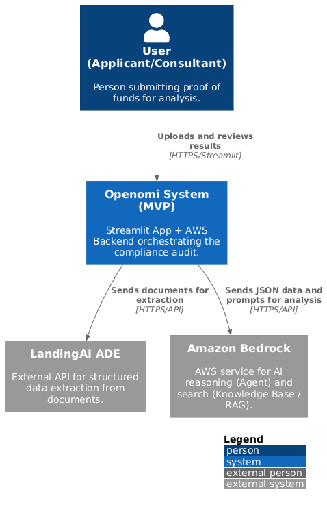
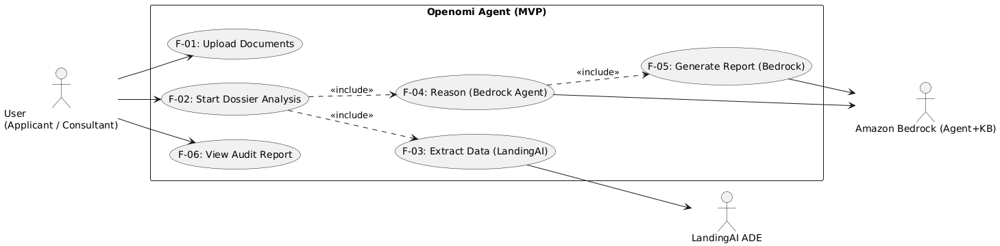

# Openomi

AI-powered financial fraud detection system that automates compliance audits for every Government process application in general and for Canadian immigration applications in particular ( this MVP ), reducing processing time from hours, days or months to few minutes.

## Problem Statement

Immigration agencies like IRCC process over 400,000 applications annually, requiring officers to manually review 6 months of bank statements per applicant. This process is slow, costly ($200M+ annually), and prone to missing sophisticated fraud (15-20% fraud rate).

**Openomi solves this by:**
- Automating document extraction with LandingAI ADE
- Detecting fraud patterns invisible to human reviewers
- Verifying program-specific compliance requirements
- Reducing processing time by 95%

## Architecture

The system uses an Agent AI architecture:


### System Context

The following diagram shows the high-level interactions between users, the Openomi system, and external services:



### Use Cases

The system supports multiple immigration program audits with program-specific compliance rules:



### Architecture Flow

```
Streamlit UI → S3 Storage → AWS Bedrock Agent → Lambda Function (LandingAI ADE)
                                    ↓
                        RAG Knowledge Base (IRCC Rules)
                                    ↓
                            Analysis Report
```

### Components

1. **Document Extraction Layer (LandingAI ADE)**
   - Parses PDFs and images to structured markdown
   - Extracts JSON data: account holder, balances, transactions
   - Handles complex layouts, handwriting, stamps

2. **AI Reasoning Layer (AWS Bedrock + Claude 3.5 Sonnet)**
   - Detects document forgery (font inconsistencies, alterations)
   - Identifies suspicious deposit patterns
   - Flags borrowed funds disguised as savings
   - Verifies income consistency

3. **Compliance Verification (RAG + Knowledge Base)**
   - Program-specific requirements (FSW, CEC, PNP, Quebec, etc.)
   - Minimum fund thresholds by family size
   - Statement history validation
   - Official IRCC regulations reference

### Technology Stack

- LandingAI Agentic Document Extraction (ADE)
- AWS Bedrock (Claude 3.5 Sonnet)
- AWS Lambda (Python 3.11)
- Amazon S3
- Streamlit (Frontend)
- RAG Knowledge Base (IRCC Rules)

## Project Structure

```
openomi/
├── app.py                                    # Streamlit frontend
├── src/
│   └── openomi_logic.py                      # Lambda handler for Bedrock Agent
├── layer/
│   └── requirements.txt                      # Python dependencies for Lambda
├── template.yaml                             # AWS SAM deployment config
├── openapi_schema.json                       # API schema for Bedrock Agent
├── instructions_agent.md                     # Agent system prompt
├── ircc-all-programs-financial-requirements.md  # Knowledge base
└── README.md
```

## Setup Instructions

### Prerequisites

- Python 3.11+
- AWS Account with permissions for S3, Lambda, Bedrock
- AWS SAM CLI installed
- LandingAI API key

### 1. Environment Configuration

Create a `.env` file:

```bash
# AWS Configuration
S3_UPLOADS_BUCKET=your-bucket-name
AWS_ACCESS_KEY_ID=your-access-key
AWS_SECRET_ACCESS_KEY=your-secret-key
AWS_DEFAULT_REGION=us-east-1

# Bedrock Agent Configuration
BEDROCK_AGENT_ID=your-agent-id
BEDROCK_AGENT_ALIAS_ID=your-agent-alias-id

# LandingAI Configuration
LANDINGAI_API_KEY=your-landingai-key
```

### 2. Deploy Lambda Function

```bash
sam build --use-container
sam deploy --guided
```

This deploys:
- Lambda Layer with dependencies
- Lambda Function with S3 permissions
- Bedrock invocation permissions

### 3. Configure Bedrock Agent

1. Create a Bedrock Agent in AWS Console
2. Add Action Group using `openapi_schema.json`
3. Link deployed Lambda ARN as the tool
4. Create Knowledge Base:
   - Upload `ircc-all-programs-financial-requirements.md`
   - Configure vector embeddings
5. Note Agent ID and Alias ID for `.env`

### 4. Run Application

```bash
# Install frontend dependencies
pip install streamlit boto3 python-dotenv

# Run Streamlit
streamlit run app.py
```

## Usage

1. Select immigration program (FSW, CEC, PNP, Quebec, etc.)
2. Specify family size
3. Upload 6 months of bank statements (PDF or images)
4. Click "Run Fraud Detection Audit"
5. Review AI-generated audit report

The system provides:
- APPROVED / NEEDS REVIEW / REJECTED verdict
- Detailed red flag analysis
- Compliance check against program requirements
- Fraud risk assessment
- Exportable reports (JSON/TXT)

## Key Features

- **Program-Specific Analysis**: Different requirements for FSW, CEC, PNP, Quebec
- **Fraud Detection**: Font analysis, suspicious deposits, borrowed funds
- **Fast Processing**: 60 seconds vs 2-4 hours manual review
- **Comprehensive Reports**: Structured audit reports for immigration officers
- **Cost Effective**: Saves $50K+ per 1000 applications

## Development

### Local Testing

Use `lambda_test_extraction.py` for local development without AWS resources.

### Deployment

The SAM template handles all infrastructure:
- Lambda Layer build with dependencies
- Function deployment with environment variables
- IAM permissions configuration
- Bedrock integration setup

## License

This project was built for the LandingAI Financial Hackathon 2024.

## Disclaimer

This is a prototype for demonstration purposes. Not intended for production use without further security auditing and compliance validation.
